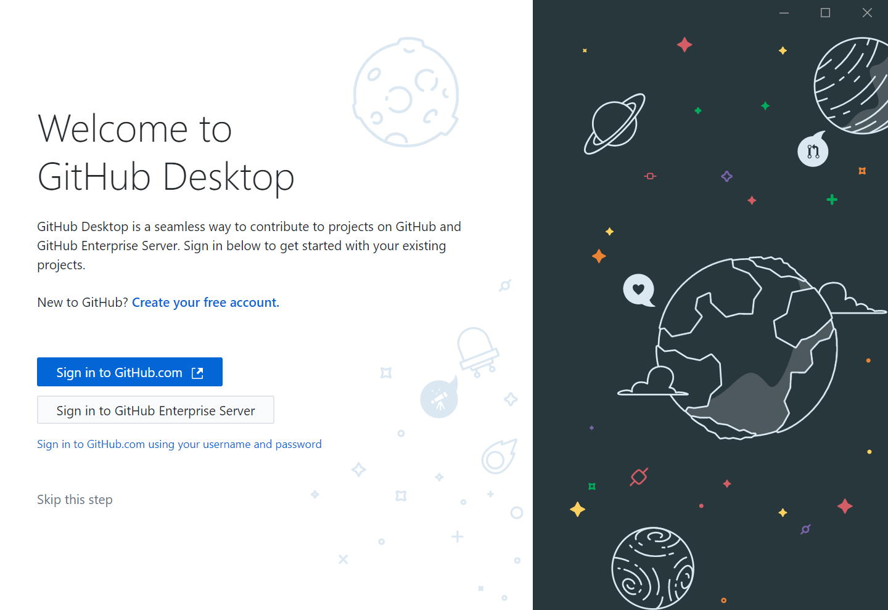
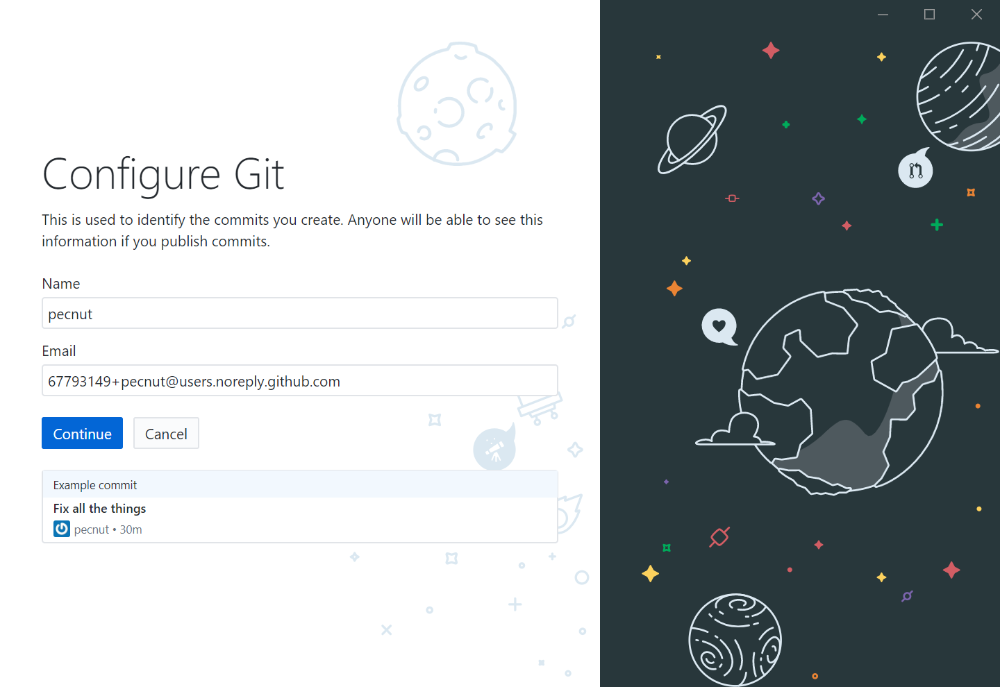
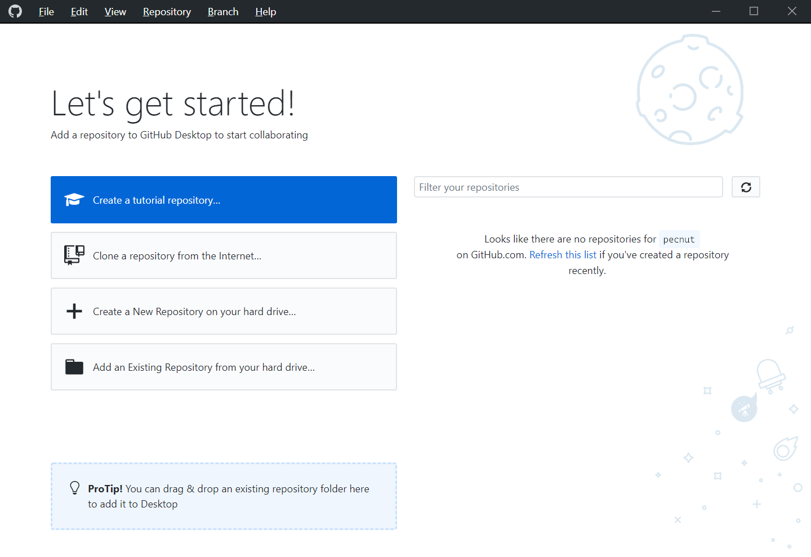

# Interdisciplinary Research Computing: Introduction to Git
Introduction to Git course for the Interdisciplinary Research Computing I-Explore module at Imperial College

1 × 2 hour class, delivered through YouTube videos

## On completion of this workshop you will be able to:
* Use Git on your own machine as a method of version control
* Use Git to synchronise the files on your own machine with those on a remote server (both pushing to the server and pulling from the server)
* Use Git to collaborate with other users on a project, including dealing with merge conflicts

This introductory course will *not* cover **branching**.

## Prerequisites
* No programming experience is required.
* We are going to be using the [GitHub desktop app](https://desktop.github.com/), so please install this on your machine before starting.

## Course materials

### 1. Motivation and Git vs GitHub

* [Watch the YouTube video for section 1](https://youtu.be/V4irZ-AzFg4)

How often have you found yourself in the following situation?

You're writing a document and you save it. Maybe you write some more. Once again you save.

That evening, you have a brilliant idea. You open up your laptop, type in your genius, and save.

Early next morning, you wake in a sweat. What were you thinking? You have to get rid of the rubbish you wrote last night. But what exactly did you write?

This is where **version control** comes in.

A version control system starts with a **base** version of your file, and then keeps track of the **changes** you make. You can get to any version of your document by 'playing back' the changes. In this way, multiple people can make changes.

And as long as these changes don't **conflict** with each other, these changes can be **merged**.

A version control system creates a permanent record of all changes to your document. Each change is called a **commit** (you decide when that happens) and the system stores **who** made the change, and **when**, along with a brief description of the change.

This record is called a **repository**, or **repo**, and repositories can be synchronised across computers, and therefore across users.

This is normally done by putting a copy of the repository online – in a central hub – and making sure everyone synchronises their repository with the remote, online version. This could be you on another computer, or someone you're working with.

GitHub is one of the most popular online hosting services for repositories, but there are others like BitBucket and GitLab.

If you don't want to synchronise between computers, you don't need to use an online host. Git – just Git – will run on your computer and you can use the full functionality that a version control system brings without going anywhere near the internet. And it's free.

This is how we're going to start - by running Git on our own computers as local version-control systems. Collaboration will come later!

What do we need to get started? Git can be run from the command line, but we're going to use the desktop application provided by GitHub - it's called GitHub Desktop! You can get it from:

* Windows/macOS: [desktop.github.com](https://desktop.github.com)
* Linux: [github.com/shiftkey/desktop](https://github.com/shiftkey/desktop)
* Old version for 32-bit Windows installations: [github.com/ahmelsayed/desktop/releases/tag/Windows-32bit](https://github.com/ahmelsayed/desktop/releases/tag/Windows-32bit)

So now you're ready to go.

But – once more – why should you use a version control system? Two great reasons:

1. It allows an unlimited 'undo'
2. It allows multiple people to work on something AT THE SAME TIME.

And Git is the most popular software for version control.

### 2. Using GitHub Desktop for the first time

You can download the GitHub Desktop software from:
* Windows/macOS: [desktop.github.com](https://desktop.github.com)
* Linux: [github.com/shiftkey/desktop](https://github.com/shiftkey/desktop)
* Old version for 32-bit Windows installations: [github.com/ahmelsayed/desktop/releases/tag/Windows-32bit](https://github.com/ahmelsayed/desktop/releases/tag/Windows-32bit)

When you open it for the first time, you will be greeted by a welcome screen:



You don't need to create an account with GitHub to use this software – after all, Git can run on your own computer without any connection to the internet. But later we are going to be collaborating with each other by pushing our files to GitHub as a central online repository. So now is a good time to sign in, or if you don't yet have an account with GitHub, to create one.

To create a free account:
* Click 'Create your free account'. The GitHub website loads, where you can enter your details.
* On the second screen, you can scroll down to 'Complete setup'.
* Verify your email address.
* Go back to GitHub Desktop, and choose either to 'Sign in to GitHub.com', or 'Sign in to GitHub.com using your username and password.'

On the next screen, you'll be asked for a name and email address that will be associated with all your commits:



This is a built-in feature of Git: all commits are associated with a name and email address. By default, GitHub provides you with a private `@users.noreply.github.com` email address which doesn't accept email, but does provide you with a unique identifier.

You will be ready to go when you see the home screen, which will (operating system depending) look something like this:



### 3. Getting started

* [Watch the YouTube video for section 3](https://youtu.be/oPTN22UvPpc)

In this section, we create a new local repository in the GitHub Desktop client and make our first commits.

Join in:
* Create a new repository by going to File > New Repository.

Our idea is to create a repository about an upcoming birthday party. We're going to include:
* A list people to invite, `invite.txt`
* A list of people confirmed as coming, `coming.txt`
* A list of people to not allow under any circumstances, `banned.txt`
* Picture: Photo you want to send to invite people, `balloons.jpg`

Join in:
* Give the repo a name, traditionally without spaces and all lowercase, `birthday-party`, and a description.
* Git will create a new folder, called `birthday-party`, within the folder described as Local Path.
* Click Create Repository.
* Let's see that Git has in fact created this folder by looking on our computer.

* Go to app - your changes are **staged**, ready to be committed.
* Commit! (With a description – don't repeat the change, try to explain *why*)

(Do this now if you haven't done so already)

* Make a change – see the difference in the GitHub desktop app.
* Commit the change.
* Look at the history tab (we'll use this later to revert changes)

Your turn:
* Add some more people to the lists.
* Add another file, `themes.txt`, containing some possible themes for the party.
* Replace the picture with another picture of the same name and see what happens.

### 4. Reverting changes

* [Watch the YouTube video for section 4](https://youtu.be/JOYlBttHhJ8)

The joy of Git is that you can try changing things without worrying that you won't be able to get back to where you started from. This is especially comforting for programming. In Git, undoing a commit is called **reverting**.

In this section, we make some edits, commit them, and then revert them.

Join in:
* We're going to add some people to the banned list - I'm banning Scroggs.
* Save, Commit.
* Now maybe I was a bit too hasty, so I'm going to revert that commit.
* History tab > Right click > Revert this Commit

And you see that Git has actually created a new commit which reverts the old commit. This detail is actually visible in the app:

* Click the revert - see "This reverts commit...".

Both the action of the revert is clear (Scroggs is removed from the banned list) but also it tells you **by ID** which commit is reverted – the hexadecimal code of the reverted commit is listed there. If you compare it to the original commit, you will see that it matches.

* Go back to your text editor and see that the commit has been reverted.

Your turn:

* I want you to create a new file, `wishlist.txt`, with a list of present ideas. Then in GitHub Desktop, commit the change, then revert the change.

#### Some common questions about reverting

1. What if you don't commit before you revert?
    * The history tab won't have a commit for your latest change, of course, so there's nothing to click. But if we try to revert the previous commit anyway out of desperation, we get an error. It is better to commit first.
    * However, it is possible to **discard** changes you've made before committing. You can "discard changes" from the changes tab by right-clicking on the change you want to discard.
    * But even though this is possible, it is harder to fix if you decide discarding was a mistake. (Behind the scenes, your changed file ends up in your operating system's Recycle Bin.) In general, it's better to commit first.

2. What about reverting multiple commits?
    * Remember that reverting **undoes changes**, it doesn't take you back to a previous version.
    * So to get back to a previous version, you have to revert changes **one at a time**.
    * Otherwise, you'll get a mess of **merge conflicts**, which we will talk about later.

3. Why does this work? Where are my old versions?
    * The answer is the hidden `.git` folder. If you turn on 'Show hidden files' in your file explorer (Cmd+Shift+Dot on Mac to toggle) you will see the `.git` folder. Inside is a bunch of files which contain all the data of all your changes.


### 5. Ignoring files

* [Watch the YouTube video for section 5](https://youtu.be/eg4dxOi77Pc)

There are occasions when we don't necessary want Git to back up, or track, files in a repository. Some examples are:
* Files containing sensitive data (e.g. personal details or API tokens)
* Files that your operating system makes (.DS_Store)
* Very large files that you don't want to sync with other people (maybe big data files)

Join in:
* Go to Repository > Repository Settings > Ignored Files
* Add, on separate lines, `*.jpg` `*.jpeg` `*.png` `cake-recipes/*.*` (This will ignore any **new** files that fit these patterns)
* This itself is a **change** (to the hidden `.gitignore` file) which we need to **commit**.

* Add a new image to the repository. No change!
* Create the `cake-recipes` folder and place a file in there.
* Add TD to the banned list, to show that still works.

Your turn:
* Add a folder `addresses` in which all text files will be ignored.
* Add some text files to the addresses folder and try to commit.

Extension: You can add exceptions using the `!`

And that's all you need for local version control! We can now **commit**, **revert**, and **ignore**. Next up, we're going to place files on the GitHub website.

### 6. Pushing to GitHub

* [Watch the YouTube video for section 6](https://youtu.be/cLgjy1-fgvc)

Time to look at sharing our code with other people. We're going to **push** our code to a **remote** repository on GitHub. GitHub allows repositories to be **public** or **private**, so even if we don't want to share, this has the benefit of backing up our code somewhere safe.

Remember that the key idea behind sharing is getting everyone to synchronise their repositories with a repository on a central hub – GitHub in our case.

The following assumes you set up a GitHub account in Section 2. Join in:
* We're going to publish our repository to GitHub. Click "Publish repository"
* Let's check it out. Repository > View on GitHub.
* Make a change to our files.
* Push to GitHub.

Your turn:
* Make a change to one of your files, commit, and push.

Join in:
* Now we'll make a change on the website, and pull the change to your computer.
* Edit a text file
* Look – the button has changed. It now says 'Pull origin' with a number saying how many commits are not in our local copy of the repository.
* Look – it works.

### 7. Collaborating through GitHub

* [Watch the YouTube video for section 7](https://youtu.be/DBWFKVsYXYY)

We're now going to see what it's like to collaborate on a project. For this, you need to get into pairs. One member of the pair will be the **owner**, and the other will be a **collaborator**. Our goal is for the collaborator to make a change to the owner's repository, which will be fully synchronised. You'll switch roles afterwards to see this process both ways round.

Join in:
* Owner gives the collaborator access on GitHub.
    * Repository > View on GitHub. Settings > Manage access > Invite a collaborator.
* Collaborator gets an email.
* Collaborator goes File > Clone Repository. Should come up in list. Happy with local path? Then click 'Clone'.

Now the collaborator can make a change!
* Add your name to the list of invited people
* Commit
* Push origin
* See that it's changed on GitHub
* Owner can now pull.
* Check out the history tab.

* Swap.

Tips on collaborating:
* Always pull before changing anything on your own machine
* Commit **little** and **often**.

Let's stay in our pairs in order to see what happens when we try editing something at the same time.


### 8. Conflict resolution

* [Watch the YouTube video for section 8](https://youtu.be/0IQAVgEN4WY)

The great thing about Git is that people can work in parallel on the same project. Despite your best efforts, at some point you're probably going to step on someone's toes!

Git is pretty good at avoiding this - you can normally edit the same text file at the same time, so long as you don't try to edit the same parts, but sometimes your changes are going to overlap.

In Git, this is called a **conflict**, and Git offers us a mechanism to **resolve** these overlapping changes.

Let's make a conflict on the last repository you played with in your pair.

Remember, I'm collaborating with Jigsaw.

Join in:
 * Person 1: At the bottom of the invited people's list, add Pedro Horse. Save.
 * Person 1: Commit and push to GitHub.
 * Person 2: *Without* pulling, add someone to the invited people's list and save.
 * Person 2: Commit. (This works because we are committing locally). But then try to push to GitHub.

 This doesn't work because the push button has become "Pull origin". Git has detected that your changes overlap with the changes in the remote repository, and you are going to have to resolve this first.

 We have to **pull** the changes from GitHub, **merge** them into our copy, and then **push** that back to GitHub.

Join in:
 * Person 2: Try pulling

 Looks like this:
 ```
+<<<<<<< HEAD
 My version
+=======
+On GitHub
+>>>>>>> hexadecimal number
 ```

 * Person 2: Remove the markers added by Git and reconcile the changes. Atom makes this easy for us!
 * Person 2: Save the changes. Commit. Push. Happy days.

 Git has tracked how we have merged the files. Look at history.

 * Swap round.

Despite Git's useful conflict resolution tools, dealing with conflicts is still slow and people can make mistakes. By committing small and often, you reduce the chances of having merge conflicts.

### 9. Wrapping up

* [Watch the YouTube video for section 9](https://youtu.be/0IQAVgEN4WY)

By now you have seen the basics of what Git can do for you. But there is much more to explore. We haven't covered:
* branching,
* releases,
* the command line interface,
* Git integration in your favourite IDE,
so go out into the world and learn all you can about this very useful tool.

Happy Gitting!
